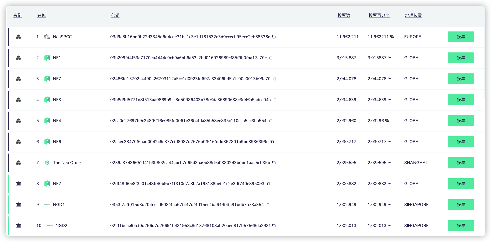

从NEO的治理策略可以知道，在共识节点与非共识节点之间，总投票数排名越靠后，我们选择其作为我们的投票节点所获取的Gas的越多。再根据共识节点与非共识节点总的可以分配的Gas的比例来看，我们应当优先选择非共识节点，再结合前面所述，为了使我们的收益最大，应当投票给排名最靠后(即第21名) 的节点

对于NeoBurger来说，逐步的运作会使得相对靠后节点的投票数逐渐趋于一致。假设迫于某种原因，需要转投其他节点，为了保证收益下降地最少，应当选择除了上面的节点之外的总投票数最少的节点A，进行投票转移。

那么先解决第一个问题，这个被”放弃“的节点应当会是上述的哪一个？因为目前的状态是最优解，转投会使收益大幅下降，要使损失最少，应当是原先收益最少的节点。也就是投票占比最少的节点B。

第二个问题，这种迫于某种原因是什么？从占比来看，要使得转移之后的占比大于我们进行“攻击”之后的占比。

第三个问题，这种迫于某种原因成本计算？节点A加上原本在节点B的投票数减去节点B当前的票数

