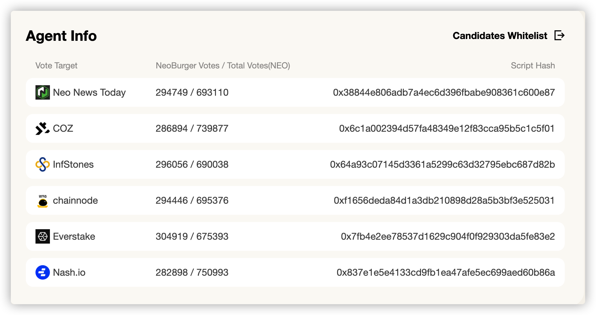
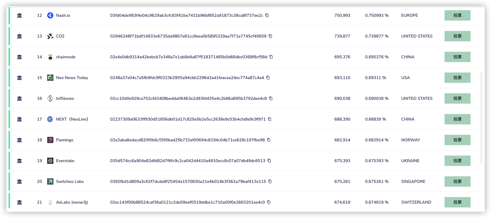

根据上图我们可以轻易的算出投票于 Nash.io 的比例最少(约为37.66%)

假设我们此时对 Nash.io 增加投票 20,6524 NEO --攻击行为

这个比例就会降为29.54%

同样我们也能找出基于neoburger目前所投节点之外总票数最少的节点  AxLabs (neow3j)

而此时将原本属于 Nash.io的投票转投  AxLabs (neow3j) 此时的持有比例也为29.54%

也就是说当我们执行攻击行为之后，neoburger策略将会把将原本属于 Nash.io的投票转投  AxLabs (neow3j)

而在neoburger策略执行下一次投票调整之前，可以操作的空间就会变得非常多

 1.继续保持 Nash.io的投票获取GAS收益

2.跟随neoburger策略转投 Nash.io  继续降低neoburger策略的收益